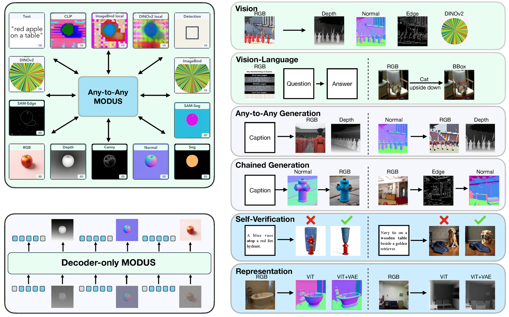
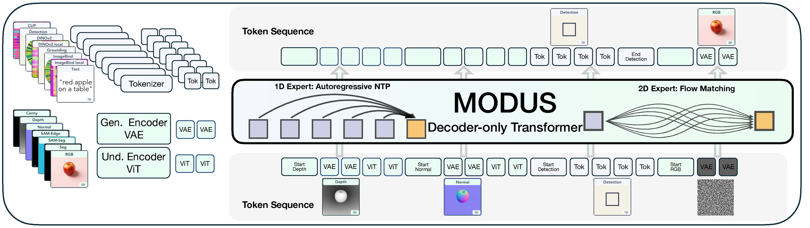

# MODUS: Decoder-only Any-to-Any Modeling of Diverse Modalities

*One decoder that treats every modality symmetrically, with no modality-specific heads, losses, or task pipelines.*

[Paper](https://storage.googleapis.com/multimodal_modus/static/modus_paper.pdf) &nbsp;·&nbsp;
[Project page](https://modus-multimodal.epfl.ch/) &nbsp;·&nbsp;
[Dataset](https://huggingface.co/datasets/epfl-vilab-modus/MODUS-15Modality) &nbsp;·&nbsp;
[Model weights](https://huggingface.co/mqye/modus-16mod-stage3) &nbsp;·&nbsp;
ICML 2026

Mingqiao Ye¹\*, Zhaochong An¹ ³\*, Zhitong Gao¹, Xian Liu⁴, François Fleuret⁵, Chuan Li⁶, Amir Zadeh⁶, Serge Belongie³, Afshin Dehghan², Jesse Allardice²†, David Mizrahi²†, Oğuzhan Fatih Kar¹ ²†, Roman Bachmann¹ ²†, Amir Zamir¹

¹EPFL &nbsp; ²Apple &nbsp; ³University of Copenhagen &nbsp; ⁴CUHK &nbsp; ⁵University of Geneva &nbsp; ⁶Lambda AI
<br><sub>\*equal contribution &nbsp; †equal technical advising</sub>

<p align="center">
  
</p>

---

## Overview

MODUS unifies any-to-any multimodal generation in a single decoder: one causal transformer trunk shared across every modality, with no separate encoder + decoder, no modality-specific weights, and no per-task pipelines. Two experts share the same causal context:

- a **1D expert** handles discrete sequences (text, grounding boxes, DINOv2 tokens, ...) with autoregressive next-token prediction (cross-entropy);
- a **2D expert** handles continuous spatial latents (VAE + ViT features) with flow matching.

Training uses exactly two losses, summed: cross-entropy for the 1D expert and a flow-matching objective for the 2D expert. There are no segmentation/depth/detection heads and no per-task decoders; every modality goes through the same trunk. The model adapts the pretrained [BAGEL-7B](https://github.com/ByteDance-Seed/Bagel) mixture-of-transformers.

<p align="center">
  
</p>

**Capabilities**
- **Any-to-any generation:** any input modality (or set of modalities) to any output modality.
- **Chained prediction:** feed a generated output back in as a condition for the next step.
- **Cross-modal self-verification:** use the same model's grounding / VQA outputs to score generated candidates against a condition.
- **Representation composition:** condition on ViT features, VAE features, or both.

## Modalities

Modalities are not hard-coded. Each is a `ModalitySpec` in `core/modality.py`, assembled into a `ModalityRegistry` from a YAML file in `conf/modalities/`. A spec declares the modality's kind, its token range for cross-entropy slicing, positional-embedding handling, and inference decoding, so the model, dataset packing, and inference share one source of truth.

The released registry (`conf/modalities/instruction_16mod_stage2.yaml`) defines 16 modalities. **Expert** indicates which branch handles it: **2D** = continuous latents via flow matching; **1D** = discrete tokens via next-token prediction.

| Modality | Expert | Description |
|---|---|---|
| `rgb` | 2D | RGB image |
| `depth` | 2D | Depth map |
| `normal` | 2D | Surface normals |
| `seg` | 2D | Semantic segmentation |
| `canny` | 2D | Canny edges |
| `samseg` | 2D | SAM masks |
| `samedge` | 2D | SAM edges |
| `text` | 1D | Free-form text |
| `caption` | 1D | Image caption |
| `det` | 1D | Grounding boxes |
| `cocodet` | 1D | COCO-style detection |
| `dino` | 1D | DINOv2 global features (VQ-tokenized) |
| `dinolocal` | 1D | DINOv2 patch features (VQ-tokenized) |
| `clip` | 1D | CLIP features (VQ-tokenized) |
| `imagebind` | 1D | ImageBind global features (VQ-tokenized) |
| `imagebindlocal` | 1D | ImageBind patch features (VQ-tokenized) |

## Repository structure

```
.
├── train.py            Training entry point (Hydra + FSDP)
├── infer.py            Any-to-any inference CLI
├── demo_modus.py       Gradio demo (any-to-any / chained / representation)
├── modeling/
│   ├── bagel/          MODUS model: Bagel + Qwen2 MoT backbone + SigLIP ViT
│   └── autoencoder.py  VAE for the 2D-expert latents
├── core/               Modality registry (modality.py) + model/tokenizer registries
├── any2any/            Inference backend: inferencer.py (engine), load_any2any.py, any2any_tasks.py
├── data/               Dataloaders + packed-sequence assembly
├── conf/               Hydra configs (train / modalities / data)
└── scripts/            Training launchers + inference examples
```

## Installation

```bash
git clone https://github.com/EPFL-VILAB/Modus.git && cd Modus
conda create -n modus python=3.11 -y && conda activate modus
pip install -r requirements.txt
# flash-attn is optional; a pure-SDPA fallback is used if it is absent:
# pip install flash_attn==2.5.8 --no-build-isolation
```

Core dependencies are `torch==2.5.1` and `transformers==4.49.0` (see `requirements.txt`). `torch>=2.5` is required for `flex_attention`.

## Model weights

The 16-modality stage-3 checkpoint is released at
[`mqye/modus-16mod-stage3`](https://huggingface.co/mqye/modus-16mod-stage3) — a
**self-contained** snapshot (trained bf16 `model.safetensors` + architecture config +
tokenizer + VAE `ae.safetensors`), so the same directory serves as both
`checkpoint_path` and `BAGEL_MODEL_PATH`; no separate BAGEL-7B-MoT download is needed.

```bash
huggingface-cli download mqye/modus-16mod-stage3 --local-dir models/modus-16mod-stage3
```

This checkpoint was trained **instruction-free**, so pass `use_instruction=false` at
inference (see the model card). It is derived from the base
[`BAGEL-7B-MoT`](https://huggingface.co/ByteDance-Seed/BAGEL-7B-MoT) weights.

## Inference

The unified CLI takes a source modality (`--condition`), a target (`--target`), and optional intermediate steps (`--intermediate`):

```bash
# RGB to depth
python infer.py --condition rgb --target depth \
    checkpoint_path=models/modus-16mod-stage3 input_image=test_images/01_basil_cathedral.jpg

# RGB to DINOv2 local feature map
python infer.py --condition rgb --target dinolocal \
    checkpoint_path=models/modus-16mod-stage3 input_image=test_images/01_basil_cathedral.jpg

# Caption to image
python infer.py --condition caption --target image \
    checkpoint_path=models/modus-16mod-stage3 prompt="a red double-decker bus in front of a clock tower"

# Chained: caption to depth to image (feed the generated depth back in)
python infer.py --condition caption --target image --intermediate depth \
    checkpoint_path=models/modus-16mod-stage3 prompt="a red double-decker bus in front of a clock tower"
```

`scripts/inference.sh` is a thin wrapper over the same CLI with usage examples for every task (any-to-any and chained).

### Interactive demo

A Gradio app exposes three tabs: any-to-any, chained prediction, and representation analysis.

```bash
export MODUS_DEMO_CHECKPOINT=models/modus-16mod-stage3   # required (self-contained snapshot)
export BAGEL_MODEL_PATH=models/modus-16mod-stage3        # same dir: config + tokenizer + VAE
python demo_modus.py --port 7860
```

## Training

Training is Hydra-configured and runs in three stages, each resuming from the previous checkpoint (all stages build the same vocabulary so checkpoints chain). Configs are in `conf/train/`; launchers in `scripts/`.

```bash
# single-node smoke test
bash scripts/modus_stage1_16mod/smoke_1node.sh

# or invoke the entrypoint directly (multi-node via torchrun / SLURM)
torchrun --nproc_per_node=<N> train.py --config modus_stage1_16mod
```

| Stage | Config | Conditioning |
|---|---|---|
| 1 | `modus_stage1_16mod` | single-condition, 16 modalities (resumes from BAGEL-7B-MoT) |
| 2 | `modus_stage2_16mod` | single-condition, 16 modalities |
| 3 | `modus_stage3_16mod` | up to three conditions, 16 modalities |

The stage scripts contain cluster-specific placeholders (`--account`, `MODUS_ROOT`, `--environment`); edit them for your setup.

## Results

As reported in the paper. See the paper for datasets, baselines, and evaluation protocols.

| Benchmark | Metric | MODUS |
|---|---|---|
| MMMU | Accuracy (%) | 51.1 |
| GenEval | Score | 0.81 |
| DIODE (Depth) | AbsRel | 0.285 |
| NYUv2 (Normal) | MAE (°) | 19.92 |
| RefCOCO (val) | Accuracy (%) | 54.5 |
| ImageNet-1k | Top-1 / Top-5 (%) | 77.9 / 92.5 |

## Citation

```bibtex
@article{ye2026modus,
  title   = {MODUS: Decoder-only Any-to-Any Modeling of Diverse Modalities},
  author  = {Ye, Mingqiao and An, Zhaochong and Gao, Zhitong and Liu, Xian
             and Fleuret, Fran\c{c}ois and Li, Chuan and Zadeh, Amir
             and Belongie, Serge and Dehghan, Afshin and Allardice, Jesse
             and Mizrahi, David and Kar, O\u{g}uzhan Fatih and Bachmann, Roman
             and Zamir, Amir},
  journal = {arXiv preprint},
  year    = {2026},
}
```

## License

Released under the [Apache 2.0 License](LICENSE). MODUS builds on [BAGEL](https://github.com/ByteDance-Seed/Bagel) (Apache 2.0); we thank the BAGEL authors.
